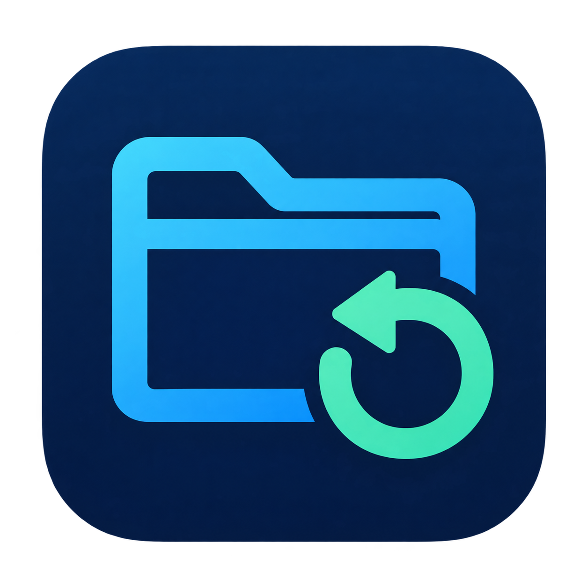

# BtoFolderLoop



**Arrastra carpetas, marca las carpetas vacías que quieras y aprueba su envío a la Papelera.**

Aplicación nativa para macOS, gratuita y de código abierto bajo **GPL-3.0-or-later**. La limpieza funciona localmente, sin cuentas ni telemetría. Solo el comprobador de versiones y el actualizador contactan con GitHub. Última publicación: **0.3.0 (preview)**, con historial, retención, lotes de carpetas, accesos directos y actualización desde la aplicación. Interfaz en español.

## Los dos modos

| Modo | Qué hace |
|---|---|
| **Una pasada** | Envía solo las carpetas que estaban vacías al analizar. No retira sus padres aunque después queden vacíos. |
| **En bucle** | También comprueba los padres que aparecen en la vista previa y los retira cuando quedan vacíos, de abajo hacia arriba. |

Por ejemplo, si `A/B/C` no contiene archivos, **una pasada** retira `C`. **En bucle** puede retirar `C`, después `B` y finalmente `A`. La carpeta principal que elegiste siempre se conserva.

**Todo empieza desmarcado y la vista previa no mueve nada.** Marca cada carpeta que quieras enviar, usa **Seleccionar todas** o **Deseleccionar todas**. Cada nuevo análisis, cambio de carpeta o cambio de modo vuelve a dejar la selección vacía.

En bucle, marcar un padre **no marca sus hijas**. Si una hija desmarcada permanece dentro, el padre se conserva. Solo se comprueba el subconjunto elegido, en el orden seguro de abajo hacia arriba.

El filtro solo oculta filas; no cambia las casillas. **Seleccionar todas** incluye todas las candidatas del análisis, incluso las ocultas por el filtro. El contador siempre muestra el total marcado y la confirmación final enseña la lista completa de seleccionadas.

## Uso

1. Arrastra una o varias carpetas a la ventana o pulsa **Elegir carpetas…**. Puedes incluir alias del Finder o enlaces simbólicos a carpetas; revisa las **Rutas reales** que aparecen.
2. Elige **Una pasada** o **En bucle**. Cambiar de modo genera una nueva vista previa.
3. Revisa el listado y marca las carpetas que quieras enviar. Las rutas que no se puedan leer se conservan.
4. Pulsa **Revisar seleccionadas…**, comprueba la lista final y confirma el envío a la Papelera. Con cero seleccionadas, el botón queda desactivado.
5. Comprueba el resultado y el **Registro**. Puedes detener el proceso antes del siguiente movimiento.

### Varias carpetas y accesos directos (desde 0.3.0)

Cada lote admite hasta 128 entradas y un máximo total de 250.000 directorios revisados. Un nuevo arrastre o elección sustituye la vista previa del lote y deja las casillas desmarcadas; no añade trabajos a una limpieza en curso. Las rutas repetidas y las incluidas dentro de otra se analizan una sola vez. **Todas las carpetas principales que elegiste se conservan**, incluso si arrastraste un padre y una hija anidada.

Los alias del Finder y enlaces simbólicos se resuelven solo al elegirlos, sin modificar el acceso original. La vista muestra el destino real; las candidatas y la confirmación incluyen la carpeta principal a la que pertenecen. Si seleccionas `A` y un alias de `A`, no se duplica el trabajo. Los accesos rotos, ciclos, archivos normales, paquetes y carpetas protegidas se señalan y se conservan. No se montan volúmenes para resolver un alias. Los accesos `.lnk` de Windows no están admitidos. Los enlaces encontrados **dentro** de un árbol siguen protegidos y no se recorren.

El lote analiza las carpetas y las ejecuta en secuencia, con un registro independiente por árbol. Un error o una orden de detener conserva las pendientes; no sigue enviando carpetas de otro árbol. La selección nunca se amplía por sí sola. Una entrada rechazada no impide revisar las demás, pero una cancelación o alcanzar el límite global invalida la vista previa parcial.

Un archivo oculto también cuenta como archivo: una carpeta con `.DS_Store` **no está vacía**. Se conservan archivos, enlaces, paquetes de aplicaciones, bibliotecas de fotos, directorios protegidos y destinos de enlaces encontrados en el árbol. No se buscan referencias fuera de la carpeta seleccionada.

Antes de cada movimiento se vuelven a comprobar la identidad, los padres y el contenido de la carpeta. Una carpeta que dejó de estar vacía se conserva. La ejecución nunca añade carpetas nuevas a la lista aprobada. Si la app encuentra un fallo ambiguo, se detiene y guarda el detalle.

## Requisitos e instalación

- macOS 14 o posterior.
- Para compilar: Xcode Command Line Tools y Swift 5.9 o posterior; recomendado Swift 6.
- Swift Package Manager descarga Sparkle **2.9.6**, fijado en `Package.resolved`, al compilar. El framework y su licencia se incluyen en la app.
- El paquete utiliza SQLite incluido en macOS. No hace falta instalar Python, Node ni un servidor para ejecutar la app.

### Compilar desde el código

```sh
git clone https://github.com/btoaldas/BtoFolderLoop.git
cd BtoFolderLoop
swift test
bash scripts/build-app.sh
open "$(cat dist/latest-app.txt)"
```

Si no tienes las herramientas de desarrollo, macOS permite instalarlas con `xcode-select --install`.

El script crea un `.app` y un ZIP en una nueva carpeta dentro de `dist/`. No sustituye una instalación existente. Para instalarlo, abre esa carpeta y arrastra `BtoFolderLoop.app` a **Aplicaciones**. Revisa cualquier aviso de reemplazo si ya tienes otra versión.

### Descargar la versión preliminar

En [Releases](https://github.com/btoaldas/BtoFolderLoop/releases) se publica el ZIP para **Apple Silicon (arm64)**, junto con `SHA256SUMS` y `BUILD-INFO.txt`. Descarga el ZIP y el archivo de comprobación en la misma carpeta y ejecuta `shasum -a 256 -c SHA256SUMS` para comprobar la descarga. Descomprime el ZIP y revisa el aviso de seguridad de macOS antes de abrir la app. Para Intel, compila desde el código en tu Mac.

La compilación inicial tiene firma local ad hoc, **sin notarización de Apple**. macOS puede bloquear un binario descargado de Internet. No se ha verificado una apertura sin avisos de Gatekeeper; tampoco se modifica su configuración. La compilación desde el código en tu propio Mac está disponible mientras se prepara una distribución firmada y notarizada.

### Actualizar desde la aplicación (desde 0.3.0)

El pie muestra la versión instalada y consulta una vez al abrir el último release compatible publicado en GitHub, incluidas las versiones preliminares de este proyecto. **Buscar actualización** repite la consulta. **Novedades** abre la página del release.

Cuando hay una versión superior, **Actualizar y reiniciar** descarga el paquete, comprueba las firmas del listado y del archivo, instala y reinicia la aplicación. Ese clic autoriza todo el proceso; macOS aún puede pedir permiso de instalación. El botón queda desactivado durante un análisis o limpieza. Mientras se actualiza, tampoco puede empezar un trabajo de carpetas. No descarga ni instala por iniciativa propia, no ofrece versiones anteriores y permite cancelar antes de preparar la instalación.

Los datos de trabajo permanecen en su carpeta local, fuera del paquete actualizado. La migración de historial hace el respaldo descrito más abajo. Si no hay conexión, un paquete compatible o un listado firmado válido, la app muestra el problema y la limpieza sigue disponible. Los diagnósticos también registran las fases de actualización con códigos, sin rutas privadas.

La versión pública **0.2.0 todavía no contiene este botón**: su primera actualización a 0.3.0 requerirá instalar el nuevo paquete. El release incluye su listado firmado y el pie comprueba la versión pública vigente. Las pruebas de instalación, reinicio y rechazo de paquetes alterados usan aplicaciones artificiales. Consulta el [procedimiento de publicación firmada](docs/runbooks/signed-updates.md). Las firmas de actualización no sustituyen la notarización de Apple.

### Desarrollo

```sh
swift run BtoFolderLoop
swift test
python3 scripts/check-public.py
```

Prueba opcional de la Papelera nativa, únicamente con carpetas artificiales:

```sh
BTOFOLDERLOOP_NATIVE_TRASH_TEST=1 swift test \
  --filter StorageAndNativeTests/testNativeSingleAndCascadeTrashWithOriginalFilePreserved
```

Prueba adicional del lote con un alias, una raíz anidada, archivos de control y dos registros independientes: `BTOFOLDERLOOP_NATIVE_BATCH_TEST=1 swift test --filter FolderInputTests/testNativeBatchWithAliasNestedRootAndIndependentReceiptChecks`. Deja tres carpetas vacías artificiales en la Papelera; verifica destinos e identidades y conserva originales y accesos.

La primera prueba deja tres carpetas vacías de ejemplo en la Papelera. No la vacía. Para ejecutar también la comprobación nativa de selección parcial usa `BTOFOLDERLOOP_NATIVE_TRASH_TEST=1 swift test`: la suite completa deja cuatro carpetas vacías artificiales en la Papelera. Las demás pruebas conservan sus datos artificiales dentro de `.tmp/`, excluido de Git.

## Configuración, registro y privacidad

SQLite guarda el modo elegido y la bitácora de movimientos en:

```text
~/Library/Application Support/BtoFolderLoop/settings.sqlite
```

Cada movimiento tiene un evento previo y un resultado. El registro incluye las rutas originales y los destinos de la Papelera; puede contener nombres privados, permanece local y no se sube a GitHub. Puedes localizarlo con **Registro → Mostrar base local**.

Desde 0.3.0, **Registro** permite consultar operaciones y carpetas trabajadas, con fecha local, modo, cantidades enviadas/conservadas, errores y última actividad. El contador se guarda durante la ejecución. El detalle muestra 200 eventos por página y permite consultar los anteriores; no limita lo que se guarda. Las listas de operaciones y carpetas muestran las 200 más recientes. «Sin cierre registrado» no significa necesariamente que una operación siga ejecutándose.

**Configuración** (engranaje o `⌘,`) permite cambiar estos valores iniciales:

| Registro | Conservación inicial | Límite |
|---|---|---|
| Diagnóstico técnico JSONL | 30 días | 10 MiB en total; segmentos de hasta 2 MiB, rotados también al cambiar de día |
| Historial de operaciones completadas | 180 días desde el cierre | Los registros pendientes, detenidos, con errores o inconsistencias se conservan |

Los archivos de diagnóstico viven en `Diagnostics`, junto a la base. Sus mensajes estructurados contienen fecha, nivel, tipo de evento, identificador de operación y contador; no contienen las rutas privadas ni mensajes de error sin filtrar. Se registra progreso resumido cada diez segundos como máximo, sin duplicar cada movimiento en texto.

Los plazos aceptan de 1 a 3650 días; el presupuesto de diagnóstico, de 1 a 100 MiB. **Guardar y aplicar** acepta la caducidad de registros existentes: al vencer un historial completado también caducan sus rutas de recuperación. Esto no toca las carpetas trabajadas ni vacía la Papelera. El historial se depura mientras la app está abierta e inactiva, como máximo una vez al día; los diagnósticos rotan al escribir. SQLite reutiliza el espacio liberado; su archivo no se reduce inmediatamente y el límite de diagnóstico no limita el historial protegido.

Antes de actualizar una base del esquema anterior se crea un respaldo SQLite `pre-schema-2-<identificador>.sqlite` en la misma carpeta. Ese respaldo no caduca automáticamente. No abras simultáneamente versiones distintas sobre la misma base ni actualices la app durante una limpieza. Volver a una versión anterior requiere revisar el respaldo y cualquier operación posterior; no hay restauración automática.

Para observar una ejecución desde terminal sin detenerla ni modificar su base, consulta [el procedimiento de solo lectura](docs/runbooks/observe-run.md).

La app nunca vacía la Papelera. Puedes recuperar las carpetas mientras sigan allí. Para una estructura anidada, devuelve primero los padres a rutas libres y luego los hijos; no sobrescribas destinos existentes. Si otra aplicación modifica el árbol o vacía la Papelera, la disponibilidad de recuperación cambia. Más detalles en [SECURITY.md](SECURITY.md).

## Estructura ampliable

| Módulo | Responsabilidad |
|---|---|
| `BtoFolderLoopCore` | Planes, modos, reglas de protección, ejecución y contratos de adaptadores. |
| `BtoFolderLoopMac` | Lectura de metadatos y Papelera nativa de macOS. |
| `BtoFolderLoopStorage` | SQLite, migraciones, preferencias y registro duradero. |
| `BtoFolderLoopApp` | Ventana, arrastrar y soltar, lista, confirmación y resultados. |

La interfaz no ejecuta SQL ni implementa las reglas de limpieza. El núcleo no depende de SwiftUI ni SQLite. Se distribuye como una sola app con módulos separados. [Arquitectura](docs/adr/001-native-modules.md) · [Requisitos](docs/specs/001-empty-folders/spec.md) · [Selección segura](docs/specs/002-selection-brand.md) · [Roadmap](ROADMAP.md) · [Contribuir](CONTRIBUTING.md).

El mismo [icono original](docs/brand/README.md) aparece en el paquete de la aplicación, Dock, ventana, confirmación, registro y Acerca de. Se generó con IA y se exporta a tamaños nativos de macOS durante la compilación.

## Estado y límites

Validación inicial en macOS 26 sobre Apple Silicon: pruebas de planificación, cancelación, cambios concurrentes, permisos, preservación de archivos, SQLite y Papelera nativa. La compatibilidad con otras versiones de macOS y proveedores de nube requiere ampliar la matriz de pruebas. Windows y Linux no están soportados en esta versión.

No repara OneDrive ni fuerza la descarga de archivos. Las entradas que no se puedan revisar quedan conservadas. Evita que otras aplicaciones escriban en el árbol durante la limpieza: ninguna API de movimiento puede garantizar ausencia total de carreras con escritores externos. El resultado se comprueba y cualquier discrepancia detiene el proceso.

## Licencia

Sparkle conserva su licencia MIT y los avisos de sus componentes, incluidos en `Sparkle-LICENSE.txt` dentro del paquete. El código propio sigue bajo GPL-3.0-or-later.

Copyright © 2026 BtoFolderLoop contributors.

This program is free software: you can redistribute it and/or modify it under the terms of the GNU General Public License as published by the Free Software Foundation, either version 3 of the License, or (at your option) any later version.

This program is distributed in the hope that it will be useful, but **WITHOUT ANY WARRANTY**; without even the implied warranty of **MERCHANTABILITY or FITNESS FOR A PARTICULAR PURPOSE**. See the [GNU General Public License](LICENSE) for more details.
