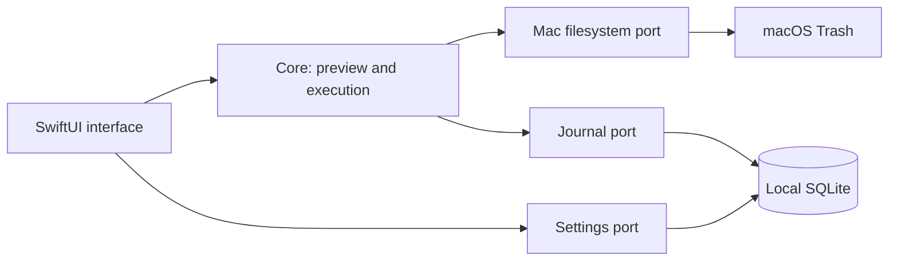

# ADR 001: Native desktop modules

Use four SwiftPM targets: Core, Mac, Storage, App. They ship in one small app bundle, but dependencies are explicit and responsibilities isolated. Core exposes analyze/execute ports; it neither imports SwiftUI nor SQLite. Storage receives immutable operation events. App composes the adapters and never runs SQL or implements cleanup rules.

SwiftUI/AppKit integrate drag-and-drop, the folder chooser and accessibility. SQLite is provided by the OS. A web shell and background HTTP server add dependencies and attack surface without a current requirement. Distributed services do not help an offline local folder operation.

Paths are private local data. They remain only in the local journal; release checks and downloads never include them. Preview is immutable and bounds execution. Filesystem identity and emptiness are rechecked before every move. Concurrent changes can still race any native filesystem operation; detect post-move discrepancies, halt and expose the recorded destination rather than hiding or deleting data.

## Update extension (0.3.0)

Keep cleanup local and its four modules independent. Use pinned Sparkle 2.9.6 for signed feed/archive verification, native installation and relaunch instead of maintaining a self-replacing shell script. A small release client and footer driver live in the app target; strict release parsing stays in the core. The SQLite journal is outside the updated bundle.
